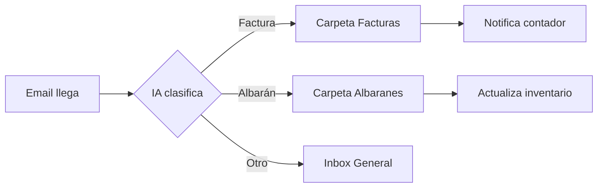

# Framework de Estrategia de Contenido - ModulorIA Blog

> Estrategia completa para el blog de ModulorIA: posicionamiento, pilares de contenido, buyer journey, y calendario editorial optimizado para generar leads B2B en construccion modular.

**Version**: 1.0
**Creado**: 2026-01-22
**Proximo review**: Despues de primer mes (4 posts publicados)

---

## Indice

1. [Pilares de Contenido](#1-pilares-de-contenido)
2. [Tipos de Contenido y Mix](#2-tipos-de-contenido-y-mix)
3. [Buyer Journey Mapping](#3-buyer-journey-mapping)
4. [Calendario Editorial](#4-calendario-editorial)
5. [Diferenciacion y Posicionamiento](#5-diferenciacion-y-posicionamiento)
6. [Plantillas y Herramientas](#6-plantillas-y-herramientas)

---

## 1. PILARES DE CONTENIDO

Los pilares son tematicas amplias y escalables que sostienen toda la estrategia de contenido. NO se limitan a los 37 puntos de dolor actuales - estos son la base inicial, pero cada pilar puede expandirse indefinidamente.

### Pilar 1: Operational Efficiency (40% del contenido)

**Objetivo**: Resolver problemas operacionales reales con automatizacion practica

**Sub-temas**:
- Automatizacion de procesos (workflows, eliminacion de tareas manuales)
- Reduccion de costos (ahorros cuantificados)
- Gestion del tiempo (ganancias de productividad)
- Prevencion de errores (mejora de calidad)
- Optimizacion de recursos (materiales, herramientas, personas)

**Topicos ejemplo**:
- "Como automatizar la clasificacion de emails ahorra 15 horas/mes en tu empresa de construccion"
- "5 quick wins de IA que recuperan su inversion en 2 semanas"
- "El costo real de NO automatizar: calculando perdidas ocultas"
- "Sistema de tracking de herramientas: de papel a QR + WhatsApp en 1 semana"

**Por que escala**:
- 37 puntos de dolor documentados = anos de contenido
- Cada problema puede generar: articulo core, solucion detallada, guia de implementacion, caso de estudio, comparativa industria
- Nuevos problemas operacionales se identifican continuamente
- Variaciones por segmento (PYMES vs medianas, construccion vs infraestructura)

---

### Pilar 2: AI & Technology in Construction (25% del contenido)

**Objetivo**: Posicionar como puente entre capacidades de IA y realidad de construccion

**Sub-temas**:
- Fundamentos de IA para audiencia no tecnica
- Tendencias tecnologicas especificas de construccion/modular
- Comparativas de herramientas y plataformas (N8N, WhatsApp bots, OCR)
- Roadmaps de transformacion digital
- Futuro de la automatizacion en construccion

**Topicos ejemplo**:
- "OCR para facturas: que es, como funciona, y por que tu contador lo necesita"
- "WhatsApp como plataforma empresarial: mas alla de los grupos de obra"
- "IA generativa vs IA operativa: cual necesita tu empresa primero"
- "N8N vs Zapier vs Make: cual es mejor para construccion modular"
- "GPT-4 vs Claude vs Llama: que modelo de IA usar para que proceso"

**Por que escala**:
- Tecnologia evoluciona constantemente
- Nuevos modelos de IA, herramientas y capacidades emergen mensualmente
- Cada nueva herramienta puede compararse con existentes
- Tutoriales y guias por herramienta
- Casos de uso especificos por tecnologia

---

### Pilar 3: Industry Insights & Trends (20% del contenido)

**Objetivo**: Demostrar comprension profunda de la industria y vision de futuro

**Sub-temas**:
- Tendencias construccion modular/industrializada
- Cambios regulatorios que afectan automatizacion
- Casos de estudio de otras geografias
- Estadisticas y benchmarks de mercado
- Analisis de panorama competitivo

**Topicos ejemplo**:
- "El mercado de construccion modular en Espana: oportunidades para 2026"
- "Como empresas de construccion en Nordics usan IA (y que podemos aprender)"
- "5 tendencias de automatizacion que cambiaran la construccion en 3 anos"
- "Analisis: por que las PYMES constructoras superan a grandes empresas en adopcion de IA"
- "Construccion offsite en LATAM: lecciones para el mercado espanol"

**Por que escala**:
- Noticias de la industria son constantes
- Puede curar + agregar comentario sobre desarrollos externos
- Analisis comparativos entre regiones
- Reportes trimestrales de tendencias
- Entrevistas con expertos de la industria

---

### Pilar 4: Founder Voice & Behind-the-Scenes (10% del contenido)

**Objetivo**: Humanizar la marca y construir conexion personal

**Sub-temas**:
- Viaje y aprendizajes de Nicolas
- Actualizaciones transparentes del negocio
- Historias de exito de clientes (con permiso)
- Desafios y fracasos
- Filosofia sobre implementacion de IA

**Topicos ejemplo**:
- "Por que deje la consultoria tradicional para enfocarme en construccion modular"
- "3 implementaciones que fallaron y que aprendi de ellas"
- "Como selecciono clientes: el fit cultural importa mas que el presupuesto"
- "Mi stack tecnologico personal: herramientas que uso cada dia"
- "Lo que nadie te cuenta sobre vender IA a constructoras"

**Por que escala**:
- Experiencias personales se acumulan continuamente
- Cada proyecto de cliente = 1-2 historias
- Lecciones de negocio emergen con el tiempo
- Opinion sobre eventos de la industria
- Cambios en metodologia y aprendizajes

---

### Pilar 5: Practical Guides & Tutorials (5% del contenido)

**Objetivo**: Contenido educacional de alto valor que posiciona como experto tecnico

**Sub-temas**:
- Guias de implementacion paso a paso
- Tutoriales de herramientas
- Templates y frameworks
- Checklists y recursos

**Topicos ejemplo**:
- "Guia completa: implementar tu primer chatbot de WhatsApp sin programar"
- "Template: como calcular el ROI de automatizacion en tu empresa"
- "Checklist: 20 puntos para auditar tu madurez digital en construccion"
- "Tutorial: configurar N8N para clasificacion automatica de emails"

**Por que escala**:
- Cada solucion de punto de dolor puede ser tutorial
- Guias por herramienta/plataforma
- Actualizaciones cuando herramientas cambian
- Templates descargables generan leads
- Tutoriales de video complementan articulos

---

## 2. TIPOS DE CONTENIDO Y MIX

### Distribucion por Tipo y Funcion

| Tipo | % | Proposito | Frecuencia | Ejemplo |
|------|---|-----------|------------|---------|
| **Problem/Solution** | 35% | SEO, lead gen | 2x/mes | "Ordenes de cambio: por que se pierden y como automatizarlas" |
| **How-To/Tutorial** | 20% | Autoridad, educacion | 1x/mes | "Como crear un sistema de tracking de herramientas con QR" |
| **Industry Analysis** | 15% | Thought leadership | 1x/mes | "Estado de la digitalizacion en construccion modular 2026" |
| **Case Study/Story** | 15% | Social proof, resultados | 1x/mes | "Como [Client] ahorro 67K/mes automatizando reportes de obra" |
| **Opinion/Trends** | 10% | Diferenciacion | 1x/mes | "Por que la IA 'inteligente' NO es lo que necesita tu obra" |
| **Founder Voice** | 5% | Conexion, confianza | Cada 2 meses | "Lo que nadie te cuenta sobre vender IA a constructoras" |

### Estrategia de Longitud de Contenido

**Quick Reads (800-1,200 palabras)**
- Identificacion de problemas, tendencias, opiniones
- Objetivo: Compartibilidad, quick wins, repurposing a LinkedIn
- Tiempo de lectura: 4-6 minutos
- Frecuencia: 60% del contenido

**Medium Deep-Dives (1,500-2,500 palabras)**
- Guias de soluciones, comparativas, how-tos
- Objetivo: Rankings SEO, features en newsletter, lead magnets
- Tiempo de lectura: 8-12 minutos
- Frecuencia: 30% del contenido

**Pillar Content (3,000-5,000+ palabras)**
- Guias definitivas, recursos comprehensivos
- Objetivo: Backlinks, autoridad, trafico de largo plazo
- Tiempo de lectura: 15-25 minutos
- Frecuencia: 10% del contenido (1 por trimestre)

### Variedad para Mantener Interes

**Formato**:
- Articulos estandar (70%)
- Listas numeradas (15%)
- Comparativas/vs (10%)
- Entrevistas/Q&A (5%)

**Tono**:
- Educacional (50%)
- Inspiracional (20%)
- Critico/controversial (15%)
- Personal/storytelling (15%)

**Enfoque**:
- Tactico/implementacion (60%)
- Estrategico/vision (25%)
- Reflexivo/filosofico (15%)

---

## 3. BUYER JOURNEY MAPPING

### Stage 1: AWARENESS (Top of Funnel)

**Mentalidad del lector**: "Tengo este problema pero no se que soluciones existen"

**Enfoque de contenido**:
- Articulos de identificacion de problemas
- Tendencias de industria mostrando lo que es posible
- Contenido de validacion "No estas solo"
- Estadisticas y benchmarks

**Ejemplos de articulos**:
- "10 senales de que tu empresa necesita automatizacion (y ni siquiera lo sabes)"
- "Cuanto tiempo pierdes realmente clasificando emails? El estudio que sorprende"
- "La crisis silenciosa: por que las PYMES constructoras luchan con procesos manuales"
- "El costo oculto de la coordinacion manual: 15K/mes que nadie calcula"

**CTAs principales**:
- Suscribirse al newsletter para mas insights
- Descargar recurso gratuito (checklist, calculadora)
- Compartir con miembros del equipo
- Comentar con su experiencia

**Metricas de exito**:
- Impresiones y trafico organico
- Tiempo en pagina (>3 min)
- Scroll depth (>75%)
- Compartidos en redes sociales
- Tasa de rebote (<60%)

---

### Stage 2: CONSIDERATION (Middle of Funnel)

**Mentalidad del lector**: "Se que necesito algo, investigando opciones"

**Enfoque de contenido**:
- Comparativas de soluciones (DIY vs agencia vs ModulorIA)
- Educacion sobre tecnologias (como funcionan las herramientas)
- Calculos de ROI y business case
- Enfoques de quick wins y pilotos

**Ejemplos de articulos**:
- "Contratar desarrollador vs agencia vs ModulorIA: que conviene realmente"
- "Los 5 quick wins de automatizacion con mejor ROI (datos reales de 15 empresas)"
- "Cuanto cuesta REALMENTE implementar IA en construccion (desglose completo)"
- "Por que empezar con un piloto de 30 dias es mas inteligente que un proyecto de 6 meses"
- "N8N + WhatsApp + Airtable: el stack que 80% de constructoras necesitan"

**CTAs principales**:
- Agendar auditoria gratuita/llamada estrategica
- Descargar calculadora de ROI
- Ver casos de estudio
- Asistir a webinar
- Suscribirse al newsletter (si aun no lo esta)

**Metricas de exito**:
- Conversion a newsletter (>5%)
- Bookings de auditoria (>2%)
- Uso de calculadora ROI
- Descarga de recursos
- Visitas a pagina de servicios

---

### Stage 3: DECISION (Bottom of Funnel)

**Mentalidad del lector**: "Listo para actuar, evaluando ModulorIA especificamente"

**Enfoque de contenido**:
- Casos de estudio detallados con resultados
- Metodologia de implementacion y proceso
- Capacidades tecnicas y stack
- Manejo de objeciones (costo, tiempo, riesgo)

**Ejemplos de articulos**:
- "Como trabajamos: el proceso ModulorIA de diagnostico a implementacion"
- "Caso de estudio: de cero a 67K/mes de ahorro en 6 semanas"
- "Que esperar en tus primeras 2 semanas trabajando con nosotros"
- "Por que ofrecemos garantia de ROI (y como la cumplimos)"
- "FAQ: las 15 preguntas mas comunes antes de contratar automatizacion"

**CTAs principales**:
- Agendar llamada de implementacion
- Solicitar propuesta
- Iniciar programa piloto
- Contactar directamente (WhatsApp, email)

**Metricas de exito**:
- Solicitudes de demo/propuesta
- Llamadas agendadas
- Propuestas enviadas
- Deals cerrados
- Attribution de contenido a ventas

---

### Flujo de Contenido en el Journey

```
AWARENESS (Trafico externo)
    |
    |--> Blog post (enfocado en problema)
    |--> Snippet en redes sociales
    |--> Publicacion en industria
    |
    v
SUSCRIPCION A NEWSLETTER
    |
    |--> Secuencia de bienvenida (3 emails)
    |--> Newsletter semanal con contenido curado
    |--> Nurture automatizado basado en interes
    |
    v
CONSIDERATION (Suscriptor engaged)
    |
    |--> Blog posts dirigidos (enfocados en solucion)
    |--> Casos de estudio
    |--> Webinars educacionales
    |--> Calculadora de ROI
    |
    v
BOOKING DE AUDITORIA
    |
    |--> Llamada estrategica gratuita (30 min)
    |--> Reporte de auditoria personalizado
    |--> Propuesta con roadmap
    |
    v
CLIENTE
```

### Indicadores de Stage Progression

**Awareness → Consideration**:
- Visito 3+ articulos
- Tiempo acumulado >15 min
- Descargo recurso
- Se suscribio a newsletter

**Consideration → Decision**:
- Abrio 3+ newsletters
- Uso calculadora ROI
- Visito pagina de precios
- Visito pagina de auditoria 2+ veces

**Decision → Cliente**:
- Agendo auditoria
- Completo formulario de auditoria
- Respondio email de seguimiento
- Visito pagina de caso de estudio

---

## 4. CALENDARIO EDITORIAL

### Cadencia Semanal: MARTES para Blog Post

**Por que Martes?**
- Decision makers B2B estan establecidos en la semana de trabajo
- Mejor engagement que Lunes (muy ocupados) o Viernes (relajandose)
- Permite que newsletter (Miercoles) referencie contenido fresco del blog
- Da tiempo para amplificacion social a traves del fin de semana

**Hora de publicacion**: 8:00-9:00 AM (Espana)
- Captura lectura matutina
- Indexacion SEO temprana
- Tiempo para compartir en redes durante el dia

---

### Estructura Mensual (4 posts/mes)

**Semana 1 - Articulo de Problem/Pain Point**
- Enfoque: Identificar problema operacional
- Objetivo: Awareness, SEO
- Longitud: 1,200-1,800 palabras
- Ejemplo: "Por que se pierden herramientas en obra (y cuanto te cuesta realmente)"

**Semana 2 - How-To/Tutorial**
- Enfoque: Educacion practica
- Objetivo: Autoridad, lead gen
- Longitud: 1,500-2,500 palabras
- Ejemplo: "Guia: implementar OCR para facturas en 3 pasos"

**Semana 3 - Industry Insight/Trend**
- Enfoque: Thought leadership
- Objetivo: Diferenciacion, compartidos
- Longitud: 1,000-1,500 palabras
- Ejemplo: "Analisis: el auge de la construccion modular en LATAM y que significa para Espana"

**Semana 4 - Case Study/Results Story**
- Enfoque: Social proof
- Objetivo: Conversion, confianza
- Longitud: 1,200-2,000 palabras
- Ejemplo: "Como [Constructor X] elimino 90% de errores en ordenes de cambio"

---

### Framework de Planificacion 90 Dias

#### MES 1: Foundation & Problem Identification

**Semana 1 (Martes 1)**: Core pain point
- Tema: Problema Tier 1 (clasificacion de emails)
- Titulo: "Caos de emails en construccion: 15 horas/mes perdidas que puedes recuperar"
- Keywords: automatizacion emails construccion, clasificacion automatica correos
- CTA: Calculadora de tiempo perdido en emails

**Semana 2 (Martes 2)**: How-To
- Tema: Quick start guide a automatizacion
- Titulo: "Guia para principiantes: tu primera automatizacion en construccion (sin programar)"
- Keywords: como automatizar procesos construccion, automatizacion sin codigo
- CTA: Descarga checklist de procesos automatizables

**Semana 3 (Martes 3)**: Industry trend
- Tema: Estado de construccion modular 2026
- Titulo: "Estado de la construccion modular en Espana 2026: datos y oportunidades"
- Keywords: construccion modular espana, tendencias construccion industrializada
- CTA: Suscribirse para actualizaciones mensuales

**Semana 4 (Martes 4)**: Founder story
- Tema: Por que ModulorIA
- Titulo: "Por que deje la consultoria tradicional para enfocarme en IA para construccion"
- Keywords: consultoria ia construccion, automatizacion empresas constructoras
- CTA: Conoce como trabajamos

---

#### MES 2: Solutions & Education

**Semana 1 (Martes 1)**: Problem
- Tema: Tool tracking chaos
- Titulo: "Herramientas perdidas en obra: el problema de 10K/mes que nadie mide"
- Keywords: control herramientas construccion, perdida equipos obra
- CTA: Calculadora de perdidas por herramientas

**Semana 2 (Martes 2)**: Tutorial
- Tema: QR code tracking system
- Titulo: "Como implementar tracking de herramientas con QR + WhatsApp (paso a paso)"
- Keywords: sistema tracking herramientas, control qr construccion
- CTA: Descarga template de implementacion

**Semana 3 (Martes 3)**: Comparison
- Tema: N8N vs Zapier
- Titulo: "N8N vs Zapier vs Make para construccion: cual es mejor (y por que)"
- Keywords: n8n construccion, zapier vs n8n, automatizacion workflows
- CTA: Agenda auditoria para saber cual necesitas

**Semana 4 (Martes 4)**: Case study placeholder/update
- Tema: Pilot program update o historia de exito
- Titulo: "Como [Constructor/Piloto] ahorro 8 horas/semana en 2 semanas"
- Keywords: caso exito automatizacion construccion, roi automatizacion
- CTA: Solicita propuesta

---

#### MES 3: Authority & Conversion

**Semana 1 (Martes 1)**: Problem
- Tema: Change order management
- Titulo: "Ordenes de cambio: por que se pierden, cuanto cuestan, y como automatizarlas"
- Keywords: ordenes cambio construccion, gestion modificaciones obra
- CTA: Descarga checklist de ordenes de cambio

**Semana 2 (Martes 2)**: ROI guide
- Tema: Calculating automation payback
- Titulo: "ROI de automatizacion en construccion: como calcular el payback real"
- Keywords: roi automatizacion construccion, calcular rentabilidad ia
- CTA: Usa calculadora interactiva

**Semana 3 (Martes 3)**: Future vision
- Tema: AI in construction 2027-2030
- Titulo: "IA en construccion 2027-2030: 5 cambios que transformaran la industria"
- Keywords: futuro ia construccion, tendencias tecnologia construccion
- CTA: Preparate con auditoria

**Semana 4 (Martes 4)**: Client success
- Tema: First pilot results
- Titulo: "Resultados del primer piloto: 67K/mes de ahorro en 6 semanas (caso completo)"
- Keywords: caso estudio ia construccion, resultados automatizacion real
- CTA: Inicia tu propio piloto

---

### Integracion Blog <-> Newsletter

**Martes: Blog Post Publicado**
- Articulo completo en website
- Optimizado para SEO
- Snippets sociales preparados
- Imagenes y diagramas incluidos

**Miercoles: Newsletter Enviado**
- Contenido curado de la semana (output de workflow RSS)
- Seccion destacada: "Esta semana publique..."
- Resumen de 200 palabras del articulo del martes
- CTA para leer articulo completo
- Enlace directo al blog post

**Beneficios de esta cadencia**:
- Suscriptores de newsletter enganchan con blog (senales SEO positivas)
- Lectores de blog se convierten en suscriptores
- Dos momentos de distribucion para mismo contenido
- Consistencia construye habito en la audiencia
- Newsletter amplifica alcance del blog

---

### Proceso de Planificacion 30-90 Dias

#### Sesion de Planificacion (Ultimo Domingo del Mes)

**1. Review de mes anterior (30 min)**
- Posts con mejor performance (trafico, conversiones)
- Rankings de keywords
- Engagement en newsletter
- Leads generados atribuibles a contenido
- Feedback de audiencia

**2. Seleccion de topicos para proximo mes (45 min)**
- 1 problema Tier 1 (quick win)
- 1 problema Tier 2 (alto impacto)
- 1 trend/industry piece
- 1 case study/story (si disponible)

**3. Keyword research (15 min por topico = 60 min)**
- Keyword primaria (busqueda en Google, Ubersuggest free)
- 3-5 terminos relacionados
- Validacion de intencion de busqueda
- Analisis de competencia (top 3 resultados)

**4. Crear content briefs (30 min por brief = 120 min)**
- Titulo de trabajo
- Keyword objetivo
- Puntos clave a cubrir
- Enlaces internos a incluir
- CTA strategy
- Fuentes/investigacion necesaria

**Tiempo total sesion**: ~4-5 horas una vez al mes

---

#### Produccion de Contenido Semanal

**Lunes (3-4 horas)**
- Investigacion profunda del topico
- Recopilacion de datos, estadisticas, ejemplos
- Outline detallado (H2s, H3s, puntos clave)
- Identificacion de diagramas/imagenes necesarias

**Martes-Jueves (4-6 horas distribuidas)**
- Escritura del draft completo
- Creacion de diagramas (Mermaid, Figma)
- Busqueda/creacion de imagenes
- Primera auto-revision

**Viernes (2-3 horas)**
- Edicion y pulido
- Optimizacion SEO (keywords, meta, alt text)
- Revision de enlaces internos
- Preparacion de snippets sociales
- Programacion en CMS

**Domingo (1 hora)**
- Scheduling en CMS para Martes 8 AM
- Preparacion de posts sociales (LinkedIn, Instagram)
- Brief para newsletter del Miercoles
- Review final pre-publicacion

**Tiempo total semanal**: 10-14 horas (puede reducirse con practica y templates)

---

### Flexibilidad Incorporada

**Slots de Contenido Reactivo (1x/trimestre)**
Reservar capacidad para responder a:
- Noticia de industria que requiere respuesta inmediata
- Historia de exito de cliente lista antes de lo planeado
- Oportunidad estacional/evento (feria, conferencia)
- Tendencia viral relacionada con construccion/IA

**Batch Production (Opcional)**
- Puede escribirse 2-3 posts en un dia enfocado
- Programar con anticipacion para vacaciones/periodos ocupados
- NUNCA publicar mas de 1/semana (calidad sobre cantidad)
- Permite crear buffer de 2-3 semanas

**Contingencias**
- Si falta contenido: reutilizar post de alto performance con actualizacion
- Si falta tiempo: publicar "quick read" de 800 palabras en lugar de deep dive
- Si falta inspiracion: analizar preguntas frecuentes de clientes/prospects

---

## 5. DIFERENCIACION Y POSICIONAMIENTO

### Posicionamiento Core: El Consultor Anti-Hype de IA

**Diferenciacion central**: ModulorIA implementa automatizacion SIMPLE, PRACTICA que funciona HOY - no fantasias futuristas de IA.

#### Que Hace Diferente a ModulorIA

**1. Enfoque Hiper-Vertical**

NO: "IA para negocios"
SI: "IA para empresas de construccion modular"

- Habla el lenguaje (obra, albaranes, subcontratistas, certificaciones)
- Entiende los problemas (no pain points genericos de negocios)
- Muestra ejemplos especificos de construccion
- Referencias a regulaciones y estandares de construccion

**En contenido**:
- Usar terminologia de construccion correctamente
- Citar normativas (CTE, LOE, ISO 9001 para construccion)
- Mencionar actores especificos (subcontratistas, aparejadores, Project Managers)
- Ejemplos con materiales, procesos, documentos reales de construccion

---

**2. Enfoque ROI-First**

NO: "Aumenta tu eficiencia"
SI: "Ahorra 15 horas/mes (3,000 euros/ano)"

- Cada articulo incluye impacto cuantificado
- Calculos transparentes mostrando la matematica
- Pricing y payback explicados claramente
- Garantias y programas piloto que reducen riesgo

**En contenido**:
- Siempre incluir seccion "Impacto Cuantificado"
- Tablas de calculo de ROI
- Antes/Despues con numeros especificos
- Timelines realistas de implementacion
- Costos transparentes (herramientas, tiempo, implementacion)

---

**3. Filosofia No-Code/Low-Code**

NO: "Necesitas un equipo de desarrolladores"
SI: "Soluciones con herramientas que ya usas (WhatsApp, email)"

- Implementacion rapida (dias/semanas, no meses)
- Cliente mantiene control y comprension
- No dependencia de proveedores tecnicos complejos
- Stack accesible y mantenible

**En contenido**:
- Workflows visuales (diagramas de flujo)
- Screenshots de herramientas en accion
- "Sin programar" o "sin codigo" cuando aplique
- Explicar logica, no solo "magia de IA"
- Tutoriales que audiencia puede seguir

---

**4. Credibilidad del Founder**

NO: Corporate speak impersonal
SI: Nicolas escribe personalmente

- Admite que no funciona, no solo exitos
- Profundidad tecnica con lenguaje accesible
- Experiencia real de implementacion, no teoria
- Opinion informada, no marketing generico

**En contenido**:
- Primera persona cuando apropiado ("En mi experiencia...")
- Historias de implementaciones fallidas
- "Aqui me equivoque..." post-mortems
- Opiniones controversiales bien fundamentadas
- Admitir limitaciones de IA

---

**5. Contenido Basado en Evidencia**

NO: "IA podria tal vez ayudar"
SI: "Aqui esta exactamente como"

- 37 puntos de dolor documentados con investigacion
- Calculos reales de costos
- Stacks tecnologicos especificos
- Diagramas de workflow y ejemplos
- Casos de uso con datos

**En contenido**:
- Fuentes citadas (estudios, estadisticas)
- Disclaimers cuando es estimacion vs dato real
- Links a herramientas y recursos mencionados
- Screenshots y pruebas visuales
- Transparencia en metodologia

---

### Guia de Tono de Voz

**QUIEN somos**: Un amigo conocedor que ya resolvio este problema exacto

**NO somos**: Corporate consultant speak, jerga academica, hype de tech bro

#### Caracteristicas del Tono

**1. DIRECTO**

Caracteristicas:
- Frases cortas cuando posible
- Afirmaciones claras, sin rodeos
- Llamar BS en la industria
- Confianza de "Asi es como es"

Ejemplos:
- MAL: "Las organizaciones pueden encontrar eficiencias aprovechando soluciones de IA"
- BIEN: "Tu empresa pierde 15 horas/mes clasificando emails. Esto se automatiza en 3 dias."

- MAL: "Se podria considerar la implementacion de sistemas automatizados"
- BIEN: "Necesitas automatizar esto. No es opcional si quieres competir en 2026."

---

**2. PRACTICO**

Caracteristicas:
- Ejemplos concretos sobre conceptos abstractos
- Numeros reales y escenarios
- "Como hacerlo" sobre "Por que hacerlo"
- Orientado a la accion

Ejemplos:
- MAL: "Optimizacion de procesos mediante automatizacion inteligente"
- BIEN: "WhatsApp + N8N + 30 minutos = sistema de reportes automatico"

- MAL: "La implementacion puede facilitar ganancias de eficiencia"
- BIEN: "Esto te ahorra 2 horas cada dia. Son 40 horas al mes. A 25 euros/hora, son 1,000 euros/mes."

---

**3. HONESTO**

Caracteristicas:
- Reconocer que IA no puede hacer
- Transparente sobre limitaciones
- Timelines y costos realistas
- No sobre-prometer

Ejemplos:
- "La IA NO va a gestionar tu obra sola. Lo que SI puede hacer es eliminar 20 horas/semana de tareas repetitivas."
- "Esta automatizacion cuesta 5,000 euros y toma 2 semanas. Si alguien te promete hacerlo en 3 dias por 500, corre."
- "He fallado 3 implementaciones por [razon]. Aqui esta que haria diferente ahora."

---

**4. ACCESIBLE**

Caracteristicas:
- Explicar conceptos tecnicos simplemente
- Usar analogias de construccion
- Definir jerga cuando necesario
- Asumir lector inteligente pero no tecnico

Ejemplos:
- "Un workflow de N8N es como un plano de obra: defines cada paso que debe pasar automaticamente."
- "OCR (Optical Character Recognition) es basicamente ensenarle a una computadora a leer facturas como lo harias tu."
- "GPT-4 es el 'cerebro' de IA. N8N es el 'sistema nervioso' que conecta todo."

---

**5. CONFIADO PERO NO ARROGANTE**

Caracteristicas:
- Compartir experiencia sin menospreciar
- Reconocer conocimiento del cliente
- Posicionar como socio, no salvador
- Respetar experiencia de industria

Ejemplos:
- "Tu conoces construccion mejor que nadie. Yo conozco automatizacion. Juntos encontramos donde se cruzan."
- "No necesitas que te explique como funciona una obra. Pero si puedo mostrarte como ahorrar 4 horas al hacer reportes."
- "Cada empresa es diferente. Este es el punto de partida, luego adaptamos."

---

### Tacticas de Diferenciacion en Contenido

**1. Cuantificar Todo**

NUNCA: "Mejora tu productividad"
SIEMPRE: "Ahorra 15 horas/mes (3,000 euros/ano)"

- Incluir calculos mostrando la matematica
- Proveer calculadoras de ROI
- Rangos cuando exactitud no es posible (ej: "5,000-10,000 euros/mes")
- Citar fuentes de numeros

---

**2. Tecnologia Especifica**

NUNCA: "Usando herramientas de IA"
SIEMPRE: "Con N8N + OpenAI GPT-4 + WhatsApp Business API"

- Nombrar herramientas, versiones, costos
- Links a recursos y documentacion
- Screenshots reales
- Alternativas cuando existen ("O puedes usar Make en lugar de N8N")

---

**3. Realidad de Implementacion**

- Incluir timelines especificos (no "rapidamente")
- Mencionar obstaculos potenciales
- Proveer secciones de troubleshooting
- Compartir que no funciono en intentos previos

Ejemplo en articulo:
```
## Timeline Realista

Dia 1-2: Setup de N8N y conexiones API
Dia 3-4: Configurar workflow y testing
Dia 5: Capacitacion de usuario
Dia 6-7: Monitoreo y ajustes

Obstaculo comun: WhatsApp Business API requiere aprobacion de Meta (1-2 dias).
Solucion temporal: Usar numero personal de WhatsApp con Twilio durante aprobacion.
```

---

**4. Contexto de Industria**

- Referenciar regulaciones de construccion
- Usar terminologia de industria correctamente
- Mostrar comprension de workflows
- Citar fuentes especificas de construccion

Ejemplo:
```
"La LOE (Ley de Ordenacion de la Edificacion) requiere documentacion completa
de la obra. El sistema de reportes automaticos asegura que cada modificacion
quede registrada con timestamp, responsable y foto, cumpliendo requisitos legales."
```

---

**5. Diferenciacion Visual**

- Diagramas de workflow (Mermaid, Figma)
- Screenshots de antes/despues
- Tablas de calculo de ROI
- Infograficos de proceso
- NO fotos stock genericas de construccion

Usar Mermaid para workflows:


---

### Diferenciacion vs Competidores

**vs Consultores Genericos de IA**
- Ellos: Estrategia amplia de IA, compromisos de meses
- ModulorIA: Especifico para construccion, quick wins en semanas

**Articulos que explotan esto**:
- "Por que la consultoria generica de IA falla en construccion"
- "Construccion no es como retail: necesitas consultores especializados"

---

**vs Empresas de Software de Construccion**
- Ellos: Plataformas grandes, caras, implementacion compleja
- ModulorIA: Automatizaciones modulares, empieza pequeno, no-code

**Articulos que explotan esto**:
- "Software de construccion vs Automatizacion modular: que necesitas realmente"
- "Por que las PYMES no necesitan Procore (y que si necesitan)"

---

**vs DIY/IT Interno**
- Ellos: Habilidades IT generales, no enfocadas en construccion
- ModulorIA: Workflows pre-construidos para construccion, deployment rapido

**Articulos que explotan esto**:
- "Cuando hacerlo tu mismo vs contratar ModulorIA"
- "Por que tu IT interno no puede (y no debe) construir automatizaciones de construccion"

---

## 6. PLANTILLAS Y HERRAMIENTAS

### Template: Content Brief

```markdown
# Content Brief - [Titulo del Articulo]

## Metadatos
- **Fecha publicacion**: [Martes, DD-MM-YYYY]
- **Pilar**: [Operational Efficiency / AI & Tech / Industry Insights / Founder Voice / Guides]
- **Tipo**: [Problem/Solution / How-To / Analysis / Case Study / Opinion / Story]
- **Buyer stage**: [Awareness / Consideration / Decision]
- **Longitud objetivo**: [800-1200 / 1500-2500 / 3000+] palabras

## SEO
- **Keyword primaria**: [keyword principal]
- **Keywords secundarias**: [keyword 2], [keyword 3], [keyword 4]
- **Intencion de busqueda**: [Informational / Commercial / Transactional]
- **Competencia**: [URL top 3 resultados de Google]

## Contenido
**Titulo de trabajo**: [Titulo completo]

**Meta description (155 chars)**:
[Descripcion que aparecera en Google]

**Hook/Problema**:
[Primera frase que engancha al lector - el problema que resuelve el articulo]

**Puntos clave a cubrir**:
1. [Punto 1]
2. [Punto 2]
3. [Punto 3]

**Estructura (H2s principales)**:
1. [H2 - Introduccion al problema]
2. [H2 - Impacto cuantificado]
3. [H2 - Solucion]
4. [H2 - Implementacion/Como funciona]
5. [H2 - ROI/Beneficios]
6. [H2 - Conclusion/Next steps]

**Datos/Estadisticas necesarias**:
- [Estadistica 1 + fuente]
- [Estadistica 2 + fuente]

**Ejemplos/Casos de uso**:
- [Ejemplo concreto 1]
- [Ejemplo concreto 2]

**Imagenes/Diagramas necesarios**:
- [ ] Hero image
- [ ] Workflow diagram
- [ ] Before/after comparison
- [ ] ROI calculation table

**Enlaces internos** (minimo 3):
- [Link a articulo relacionado 1]
- [Link a servicio]
- [Link a recurso/calculadora]

**CTA principal**:
[Que quieres que haga el lector? Agenda auditoria / Descarga recurso / Suscribe newsletter]

**CTA secundario**:
[CTA alternativo si primario no aplica]

## Notas de produccion
**Investigacion necesaria**:
- [ ] [Item de investigacion 1]
- [ ] [Item de investigacion 2]

**Fecha inicio escritura**: [DD-MM-YYYY]
**Fecha target finalizacion**: [DD-MM-YYYY]
**Responsable**: [Nicolas / Agente de contenido]

**Checklist pre-publicacion**:
- [ ] Keywords en title, H1, primeros 100 palabras
- [ ] Meta description optimizada
- [ ] 3+ enlaces internos
- [ ] Imagenes con alt text
- [ ] CTA claro al final
- [ ] Social snippets preparados (LinkedIn, Twitter)
- [ ] Mencion en brief de newsletter del miercoles
```

---

### Template: Estructura de Articulo Problem/Solution

```markdown
# [Titulo con Keyword Primaria]

[Meta description aqui]

## [H2: Hook - El Problema]

[1-2 parrafos estableciendo el problema de forma relatable]

**Pregunta retorica o estadistica impactante**

[2-3 parrafos profundizando en el problema con ejemplos concretos]

---

## [H2: Por Que Sucede Esto]

[Explicar causas raiz del problema]

[Lista de 3-5 razones principales]

1. **Razon 1**: Descripcion
2. **Razon 2**: Descripcion
3. **Razon 3**: Descripcion

---

## [H2: El Costo Real (Impacto Cuantificado)]

[Seccion que calcula cuanto cuesta este problema]

**Calculo ejemplo**:

```
Horas perdidas/mes: 15 horas
Costo por hora: 25 euros
Costo mensual: 375 euros
Costo anual: 4,500 euros
```

[Tabla con diferentes escenarios: PYME vs mediana empresa]

---

## [H2: La Solucion - Automatizacion Practica]

[Introducir solucion de alto nivel]

[Explicar como funciona en lenguaje simple]

**Stack tecnologico**:
- [Herramienta 1]: Para que sirve
- [Herramienta 2]: Para que sirve
- [Herramienta 3]: Para que sirve

---

## [H2: Como Funciona (Paso a Paso)]

[Workflow diagram con Mermaid o imagen]

**Paso 1: [Nombre del paso]**
[Descripcion detallada]

**Paso 2: [Nombre del paso]**
[Descripcion detallada]

**Paso 3: [Nombre del paso]**
[Descripcion detallada]

[Etc.]

---

## [H2: Implementacion - Timeline y Esfuerzo]

**Tiempo de implementacion**: [X dias/semanas]

**Fase 1 (Dias 1-X)**: [Que se hace]
**Fase 2 (Dias X-Y)**: [Que se hace]
**Fase 3 (Dias Y-Z)**: [Que se hace]

**Costo estimado**: [Rango de inversion]

---

## [H2: ROI y Beneficios]

**Ahorro mensual**: [Calculo]
**Inversion inicial**: [Costo]
**Payback**: [Tiempo para recuperar inversion]
**ROI a 12 meses**: [Porcentaje]

[Tabla comparativa antes/despues]

**Beneficios adicionales**:
- [Beneficio cualitativo 1]
- [Beneficio cualitativo 2]
- [Beneficio cualitativo 3]

---

## [H2: Primeros Pasos]

[Como puede el lector empezar]

**Si quieres hacerlo tu mismo**:
1. [Paso 1]
2. [Paso 2]
3. [Recurso/link util]

**Si quieres ayuda profesional**:
[Descripcion de servicio de ModulorIA]

[CTA principal con link]

---

## Conclusion

[Resumen de 2-3 parrafos]

[CTA secundario]

---

**Articulos relacionados**:
- [Link interno 1]
- [Link interno 2]
- [Link interno 3]
```

---

### Checklist: Pre-Publicacion

```markdown
## SEO & Technical

- [ ] Keyword primaria en:
  - [ ] Title (H1)
  - [ ] URL slug
  - [ ] Primeros 100 palabras
  - [ ] Al menos un H2
  - [ ] Meta description

- [ ] Meta description:
  - [ ] 150-155 caracteres
  - [ ] Include keyword
  - [ ] Include CTA o value proposition

- [ ] Imagenes:
  - [ ] Hero image optimizada (<200KB)
  - [ ] Alt text descriptivo en todas
  - [ ] File names descriptivos (no DSC_1234.jpg)

- [ ] Enlaces:
  - [ ] 3+ enlaces internos relevantes
  - [ ] Enlaces externos abren en nueva pestana
  - [ ] No broken links (verificar con herramienta)

- [ ] Formato:
  - [ ] Jerarquia de headers correcta (H1 > H2 > H3)
  - [ ] Parrafos cortos (<4 lineas)
  - [ ] Listas y bullets para escaneo facil
  - [ ] Negrita en conceptos clave

## Contenido

- [ ] Hook fuerte en primeros 2 parrafos
- [ ] Problema claramente definido
- [ ] Solucion especifica y accionable
- [ ] Numeros/datos cuantificados incluidos
- [ ] Ejemplos concretos de construccion
- [ ] Tono consistente con guia de voz
- [ ] Sin jerga sin explicar
- [ ] CTA claro al final
- [ ] Conclusion que resume key points

## Amplificacion

- [ ] Snippets sociales preparados:
  - [ ] LinkedIn post (1,300 chars)
  - [ ] LinkedIn post alternativo
  - [ ] Twitter thread (5-7 tweets)

- [ ] Imagenes sociales:
  - [ ] Quote card (1:1 para Instagram)
  - [ ] Featured image (1200x630 para LinkedIn)

- [ ] Newsletter brief:
  - [ ] Resumen de 150-200 palabras escrito
  - [ ] Link y CTA para newsletter del miercoles

## Legal & Compliance

- [ ] Fuentes citadas apropiadamente
- [ ] Disclaimers si es necesario
- [ ] No claims exagerados o sin fundamento
- [ ] Precios/costos con "aproximado" si no garantizados

## Final Review

- [ ] Leer en voz alta (detectar frases torpes)
- [ ] Revisar en mobile preview
- [ ] Spell check y grammar check
- [ ] Verificar que CTA links funcionan
- [ ] Programado para Martes 8:00 AM
```

---

### Tool: Calculadora de Esfuerzo de Contenido

**Tiempo estimado por tipo de post**:

| Tipo | Longitud | Investigacion | Escritura | Edicion | Total |
|------|----------|---------------|-----------|---------|-------|
| Quick Read | 800-1,200 | 1-2h | 2-3h | 1h | 4-6h |
| Medium Dive | 1,500-2,500 | 2-3h | 3-4h | 1-2h | 6-9h |
| Pillar | 3,000-5,000+ | 4-6h | 6-8h | 2-3h | 12-17h |

**Factores que aumentan tiempo**:
- Datos/estadisticas propias (calculos): +2-3h
- Diagramas complejos: +1-2h
- Screenshots/tutoriales paso a paso: +2-3h
- Entrevistas: +2-4h (incluye coordinacion)

**Factores que reducen tiempo**:
- Topico ya conocido muy bien: -1-2h
- Content brief muy detallado: -1h
- Templates reutilizables: -30min-1h
- Experiencia (despues de 10-15 posts): -20-30% tiempo total

---

### Herramientas Recomendadas

**Escritura y SEO**:
- Google Docs (colaboracion, versionado)
- Notion (organizacion, content calendar)
- Grammarly (grammar y claridad)
- Hemingway App (legibilidad)

**Keyword Research** (Opciones gratuitas):
- Google Search Console (datos reales de tu sitio)
- Ubersuggest (limite gratis: 3 busquedas/dia)
- Answer the Public (preguntas relacionadas)
- Google Trends (estacionalidad y tendencias)

**Imagenes y Diagramas**:
- Canva (graficos, quote cards, social images)
- Mermaid (diagramas de flujo en markdown)
- Figma (mockups y workflows complejos)
- Unsplash/Pexels (fotos stock gratuitas)

**Analisis y Tracking**:
- Google Analytics 4 (trafico y conversiones)
- Google Search Console (rankings y impresiones)
- Plausible/Fathom (alternativas privacy-friendly)

**Automatizacion**:
- N8N (workflow para distribucion de contenido)
- Buffer/Hootsuite (scheduling social, planes gratuitos limitados)
- Zapier (integraciones entre herramientas)

---

## Proximos Pasos

### Implementacion Inmediata (Esta Semana)

1. **Revisar y aprobar este framework**
   - [ ] Leer documento completo
   - [ ] Identificar ajustes necesarios
   - [ ] Aprobar para implementacion

2. **Configurar infraestructura basica**
   - [ ] Crear seccion /blog en web (si no existe)
   - [ ] Setup Notion con content calendar
   - [ ] Crear templates (brief, checklist)

3. **Planificar Mes 1**
   - [ ] Seleccionar 4 topicos (Semanas 1-4)
   - [ ] Keyword research para cada uno
   - [ ] Crear content briefs detallados

4. **Escribir primer post**
   - [ ] Semana 1 topic (problema Tier 1)
   - [ ] Seguir template Problem/Solution
   - [ ] Checklist pre-publicacion
   - [ ] Programar para Martes

### Mes 1 (Primeros 4 Posts)

- [ ] Post 1: Problema Tier 1 (ej: clasificacion emails)
- [ ] Post 2: How-To / Tutorial
- [ ] Post 3: Industry insight / Trend
- [ ] Post 4: Founder story o case study

- [ ] Monitorear metricas iniciales (trafico, engagement)
- [ ] Ajustar calendario Mes 2 basado en performance

### Mes 2-3 (Consolidacion)

- [ ] 8 posts adicionales (total 12 en 3 meses)
- [ ] Analizar que pilares/tipos funcionan mejor
- [ ] Iterar en tono de voz y estructura
- [ ] Empezar repurposing (blog → social snippets)

### Optimizacion Continua

- [ ] Review mensual de metricas
- [ ] Actualizar keywords based on rankings
- [ ] Identificar contenido para actualizar/expandir
- [ ] Construir internal linking entre posts

---

**Documento Vivo**: Este framework debe revisarse y actualizarse cada trimestre basado en performance y aprendizajes.

**Feedback Loop**: Documentar que funciona y que no. Iterar rapidamente.

**Objetivo Final**: Convertir blog en motor de leads calificados que nutre pipeline comercial de forma predecible.

---

**Creado**: 2026-01-22
**Version**: 1.0
**Proximo review**: Despues de 4 posts publicados (fin Mes 1)
